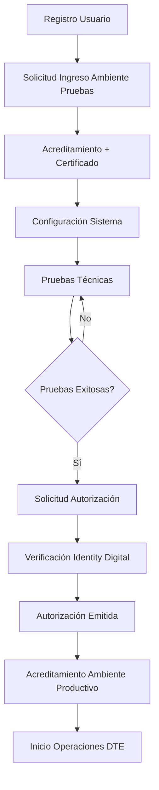
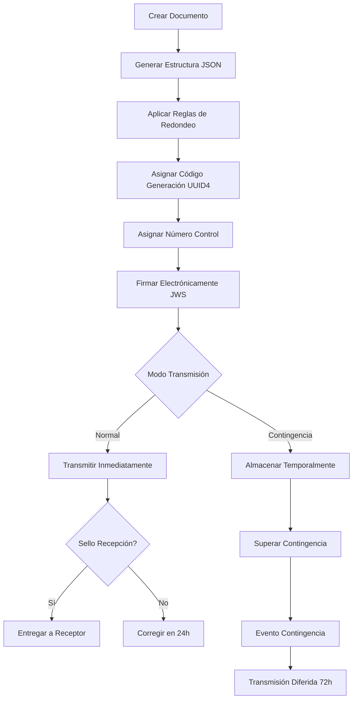

# 📋 PLANIFICACIÓN COMPLETA DEL SISTEMA DTE - FACTURACIÓN SAAS

## 🎯 **RESUMEN EJECUTIVO**

Este documento presenta la planificación completa para implementar un Sistema de Facturación SaaS compatible con la normativa de Documentos Tributarios Electrónicos (DTE) de El Salvador. El sistema permitirá a los contribuyentes generar, firmar, transmitir y gestionar DTE de forma automatizada y cumpliendo con todas las especificaciones técnicas de la DGII.

---

## 📊 **ANÁLISIS DE DOCUMENTACIÓN TÉCNICA REVISADA**

### **Manuales Analizados:**
1. ✅ **Guía del Proceso de Incorporación para Ser Emisor DTE**
2. ✅ **Manual de Acreditamiento y Obtención de Certificado de Firma Electrónica**
3. ✅ **Manual de Solicitud en Línea para ser Autorizado como Emisor DTE**
4. ✅ **Manual de Usuario del Sitio de Emisores DTE**
5. ✅ **Normativa de Cumplimiento de los Documentos Tributarios Electrónicos**

---

## 🏗️ **ARQUITECTURA DEL SISTEMA**

### **Stack Tecnológico:**
- **Backend:** ASP.NET Core 8.0 (C#)
- **Frontend:** Blazor Server / MVC
- **Base de Datos:** SQL Server
- **Autenticación:** ASP.NET Core Identity + OAuth (Google/Microsoft)
- **APIs:** RESTful APIs para integración DGII
- **Firma Digital:** JWS (JSON Web Signature)
- **Formato:** JSON para documentos DTE

### **Arquitectura en Capas:**
```
┌─────────────────────────────┐
│     Presentación (UI)       │
├─────────────────────────────┤
│   Capa de Servicios (API)   │
├─────────────────────────────┤
│    Lógica de Negocio        │
├─────────────────────────────┤
│   Acceso a Datos (EF Core)  │
├─────────────────────────────┤
│    Base de Datos SQL        │
└─────────────────────────────┘
```

---

## 📋 **MÓDULOS DEL SISTEMA**

### **1. MÓDULO DE GESTIÓN DE USUARIOS**
- ✅ **YA IMPLEMENTADO:** Registro con Email/Contraseña
- ✅ **YA IMPLEMENTADO:** Login con Google/Microsoft OAuth
- 🔄 **Extensión:** Gestión de perfiles empresariales
- 🔄 **Extensión:** Roles y permisos específicos DTE

### **2. MÓDULO DE INCORPORACIÓN DTE**
#### **2.1 Solicitud de Ingreso**
- Formulario de solicitud al ambiente de pruebas
- Validación de requisitos mínimos
- Envío automático a DGII

#### **2.2 Proceso de Acreditamiento**
- **Paso 1:** Verificación de información RUC
- **Paso 2:** Generación de certificado de firma electrónica
- **Paso 3:** Selección de tipos de DTE
- **Paso 4:** Descarga de certificados y credenciales

#### **2.3 Solicitud de Autorización**
- **Paso 1:** Selección de DTE con pruebas exitosas
- **Paso 2:** Datos de notificación
- **Paso 3:** Confirmación de autorizaciones
- **Paso 4:** Revisión de solicitud
- **Paso 5:** Presentación de solicitud
- **Paso 6:** Verificación de email
- **Paso 7:** Recepción de autorización

### **3. MÓDULO DE GESTIÓN DE CERTIFICADOS**
- Almacenamiento seguro de certificados
- Gestión de claves públicas/privadas
- Renovación automática de certificados
- Monitoreo de vencimientos

### **4. MÓDULO DE GENERACIÓN DE DTE**
#### **4.1 Tipos de Documentos Soportados**
1. **CCFE** - Comprobante de Crédito Fiscal Electrónico
2. **FE** - Factura Electrónica
3. **FEXE** - Factura de Exportación Electrónica
4. **NRE** - Nota de Remisión Electrónica
5. **NCE** - Nota de Crédito Electrónica
6. **NDE** - Nota de Débito Electrónica
7. **CLE** - Comprobante de Liquidación Electrónico
8. **CRE** - Comprobante de Retención IVA Electrónico
9. **DCLE** - Documento Contable de Liquidación Electrónico
10. **FSEE** - Factura de Sujeto Excluido Electrónica
11. **CDE** - Comprobante de Donación Electrónico

#### **4.2 Componentes de Generación**
- Generador de UUID v4 (Código de Generación)
- Generador de Número de Control
- Motor de cálculo con reglas de redondeo
- Validador de estructura de datos
- Constructor de JSON según normativa

### **5. MÓDULO DE FIRMA ELECTRÓNICA**
- Implementación de JWS (JSON Web Signature)
- Integración con certificados DGII
- Validación de firmas
- Gestión de llaves criptográficas

### **6. MÓDULO DE TRANSMISIÓN**
#### **6.1 Modos de Transmisión**
- **Normal:** Transmisión previa (antes de entrega)
- **Contingencia:** Transmisión diferida (hasta 72 horas)

#### **6.2 Integraciones API**
- APIs de autenticación DGII
- APIs de transmisión de documentos
- APIs de consulta de estados
- APIs de eventos (invalidación/contingencia)

### **7. MÓDULO DE GESTIÓN DE ESTADOS**
#### **7.1 Estados de Documentos**
- ✅ **Transmitido Satisfactoriamente**
- 🔄 **Ajustado**
- ⚠️ **Observado**
- ❌ **Rechazado**
- 🚫 **Invalidado**

#### **7.2 Dashboard de Monitoreo**
- Panel de control de documentos
- Alertas de documentos rechazados
- Estadísticas de transmisión
- Reportes de cumplimiento

### **8. MÓDULO DE EVENTOS**
#### **8.1 Evento de Invalidación**
- Anulación de documentos con errores
- Plazos específicos por tipo de documento
- Generación automática de eventos

#### **8.2 Evento de Contingencia**
- Gestión de situaciones de fuerza mayor
- Notificación automática a DGII
- Transmisión diferida de documentos

### **9. MÓDULO DE CONSULTAS**
- Consulta pública de DTE
- Verificación de sellos de recepción
- Historial de documentos
- Reportes fiscales

### **10. MÓDULO DE CONFIGURACIÓN**
- Configuración de establecimientos
- Códigos de puntos de venta
- Parámetros de empresa
- Configuración de impuestos

---

## 🗃️ **DISEÑO DE BASE DE DATOS**

### **Entidades Principales:**

```sql
-- Usuarios y Empresas
CREATE TABLE Empresas (
    Id UNIQUEIDENTIFIER PRIMARY KEY DEFAULT NEWID(),
    NIT NVARCHAR(14) NOT NULL UNIQUE,
    RazonSocial NVARCHAR(255) NOT NULL,
    TipoContribuyente INT NOT NULL, -- 1=Natural, 2=Jurídica
    Estado INT NOT NULL DEFAULT 1,
    FechaCreacion DATETIME2 NOT NULL DEFAULT GETUTCDATE()
);

-- Certificados de Firma Electrónica
CREATE TABLE Certificados (
    Id UNIQUEIDENTIFIER PRIMARY KEY DEFAULT NEWID(),
    EmpresaId UNIQUEIDENTIFIER NOT NULL,
    TipoSistema INT NOT NULL, -- 1=Transmisión, 2=Facturación
    TipoAmbiente INT NOT NULL, -- 1=Pruebas, 2=Productivo
    CertificadoData VARBINARY(MAX) NOT NULL,
    ClavePublica NVARCHAR(MAX) NOT NULL,
    ClavePrivada NVARCHAR(MAX) NOT NULL, -- Encriptada
    PasswordAPI NVARCHAR(255) NULL,
    FechaCreacion DATETIME2 NOT NULL,
    FechaVencimiento DATETIME2 NULL,
    Estado INT NOT NULL DEFAULT 1,
    FOREIGN KEY (EmpresaId) REFERENCES Empresas(Id)
);

-- Documentos DTE
CREATE TABLE DocumentosDTE (
    Id UNIQUEIDENTIFIER PRIMARY KEY DEFAULT NEWID(),
    EmpresaId UNIQUEIDENTIFIER NOT NULL,
    CodigoGeneracion UNIQUEIDENTIFIER NOT NULL UNIQUE,
    NumeroControl NVARCHAR(31) NOT NULL,
    TipoDocumento INT NOT NULL,
    Estado INT NOT NULL,
    SelloRecepcion NVARCHAR(255) NULL,
    FechaGeneracion DATETIME2 NOT NULL,
    FechaTransmision DATETIME2 NULL,
    DocumentoJSON NVARCHAR(MAX) NOT NULL,
    FirmaElectronica NVARCHAR(MAX) NULL,
    MotivoRechazo NVARCHAR(500) NULL,
    UserId NVARCHAR(450) NOT NULL,
    FOREIGN KEY (EmpresaId) REFERENCES Empresas(Id)
);

-- Eventos DTE
CREATE TABLE EventosDTE (
    Id UNIQUEIDENTIFIER PRIMARY KEY DEFAULT NEWID(),
    DocumentoId UNIQUEIDENTIFIER NOT NULL,
    TipoEvento INT NOT NULL, -- 1=Invalidación, 2=Contingencia
    CodigoGeneracion UNIQUEIDENTIFIER NOT NULL,
    Motivo NVARCHAR(500),
    FechaEvento DATETIME2 NOT NULL,
    EstadoEvento INT NOT NULL,
    EventoJSON NVARCHAR(MAX) NOT NULL,
    SelloRecepcion NVARCHAR(255) NULL,
    FOREIGN KEY (DocumentoId) REFERENCES DocumentosDTE(Id)
);

-- Establecimientos y Puntos de Venta
CREATE TABLE Establecimientos (
    Id UNIQUEIDENTIFIER PRIMARY KEY DEFAULT NEWID(),
    EmpresaId UNIQUEIDENTIFIER NOT NULL,
    Codigo NVARCHAR(4) NOT NULL,
    Nombre NVARCHAR(255) NOT NULL,
    Direccion NVARCHAR(500),
    Estado INT NOT NULL DEFAULT 1,
    FOREIGN KEY (EmpresaId) REFERENCES Empresas(Id)
);

CREATE TABLE PuntosVenta (
    Id UNIQUEIDENTIFIER PRIMARY KEY DEFAULT NEWID(),
    EstablecimientoId UNIQUEIDENTIFIER NOT NULL,
    Codigo NVARCHAR(4) NOT NULL,
    Descripcion NVARCHAR(255) NOT NULL,
    Estado INT NOT NULL DEFAULT 1,
    FOREIGN KEY (EstablecimientoId) REFERENCES Establecimientos(Id)
);

-- Solicitudes de Incorporación
CREATE TABLE SolicitudesIncorporacion (
    Id UNIQUEIDENTIFIER PRIMARY KEY DEFAULT NEWID(),
    EmpresaId UNIQUEIDENTIFIER NOT NULL,
    TipoSolicitud INT NOT NULL, -- 1=Primera vez, 2=Ampliación
    TiposSistema NVARCHAR(50) NOT NULL, -- JSON array
    TiposDocumento NVARCHAR(500) NOT NULL, -- JSON array
    Estado INT NOT NULL, -- 1=Pendiente, 2=Aprobada, 3=Rechazada
    FechaSolicitud DATETIME2 NOT NULL,
    FechaRespuesta DATETIME2 NULL,
    AutorizacionPDF VARBINARY(MAX) NULL,
    FOREIGN KEY (EmpresaId) REFERENCES Empresas(Id)
);
```

---

## 🔄 **FLUJO DE PROCESOS**

### **1. Flujo de Incorporación como Emisor DTE**


### **2. Flujo de Generación y Transmisión DTE**


---

## 🛠️ **ESPECIFICACIONES TÉCNICAS**

### **1. Generación de Códigos**
```csharp
public class CodigoGeneracionService
{
    public Guid GenerarCodigoGeneracion()
    {
        return Guid.NewGuid(); // UUID v4
    }
    
    public string GenerarNumeroControl(TipoDocumento tipo, string establecimiento, string puntoVenta)
    {
        var year = DateTime.Now.Year;
        var consecutivo = ObtenerSiguienteConsecutivo(tipo, establecimiento, puntoVenta, year);
        return $"DTE-{(int)tipo:D2}-{establecimiento}{puntoVenta}-{consecutivo:D15}";
    }
}
```

### **2. Reglas de Redondeo**
```csharp
public class CalculadorDTE
{
    public decimal RedondearItem(decimal valor)
    {
        return Math.Round(valor, 8, MidpointRounding.AwayFromZero);
    }
    
    public decimal RedondearResumen(decimal valor)
    {
        return Math.Round(valor, 2, MidpointRounding.AwayFromZero);
    }
    
    public bool ValidarHolgura(decimal valorCalculado, decimal valorEsperado)
    {
        var diferencia = Math.Abs(valorCalculado - valorEsperado);
        return diferencia <= 0.01m;
    }
}
```

### **3. Firma Electrónica JWS**
```csharp
public class FirmaElectronicaService
{
    public string FirmarDocumento(string documentoJSON, X509Certificate2 certificado)
    {
        var handler = new JsonWebTokenHandler();
        var payload = documentoJSON;
        
        var descriptor = new SecurityTokenDescriptor
        {
            Claims = new Dictionary<string, object> { { "dte", payload } },
            SigningCredentials = new X509SigningCredentials(certificado)
        };
        
        return handler.CreateToken(descriptor);
    }
}
```

### **4. Validaciones**
```csharp
public class ValidadorDTE
{
    public ValidationResult ValidarEstructura(DocumentoDTE documento)
    {
        var result = new ValidationResult();
        
        // Validar campos obligatorios
        if (string.IsNullOrEmpty(documento.CodigoGeneracion.ToString()))
            result.AddError("Código de generación requerido");
            
        // Validar formato JSON
        if (!EsJSONValido(documento.DocumentoJSON))
            result.AddError("Formato JSON inválido");
            
        // Validar reglas de negocio
        ValidarReglasNegocio(documento, result);
        
        return result;
    }
}
```

---

## 📅 **CRONOGRAMA DE IMPLEMENTACIÓN**

### **FASE 1: FUNDACIÓN (4 semanas)**
- ✅ **Semana 1-2:** Análisis y diseño de arquitectura
- 🔄 **Semana 3:** Configuración de base de datos
- 🔄 **Semana 4:** Módulo de gestión de usuarios extendido

### **FASE 2: INCORPORACIÓN DTE (6 semanas)**
- 🔄 **Semana 5-6:** Módulo de solicitud de ingreso
- 🔄 **Semana 7-8:** Proceso de acreditamiento
- 🔄 **Semana 9-10:** Solicitud de autorización

### **FASE 3: GENERACIÓN DE DOCUMENTOS (8 semanas)**
- 🔄 **Semana 11-12:** Motor de generación de DTE
- 🔄 **Semana 13-14:** Implementación de tipos de documentos
- 🔄 **Semana 15-16:** Validaciones y reglas de negocio
- 🔄 **Semana 17-18:** Módulo de firma electrónica

### **FASE 4: TRANSMISIÓN (6 semanas)**
- 🔄 **Semana 19-20:** APIs de integración DGII
- 🔄 **Semana 21-22:** Gestión de estados
- 🔄 **Semana 23-24:** Módulo de eventos

### **FASE 5: TESTING Y DESPLIEGUE (4 semanas)**
- 🔄 **Semana 25-26:** Pruebas unitarias e integración
- 🔄 **Semana 27:** Pruebas con ambiente DGII
- 🔄 **Semana 28:** Despliegue y puesta en producción

---

## 🧪 **ESTRATEGIA DE TESTING**

### **1. Pruebas Unitarias**
- Pruebas de generación de códigos
- Pruebas de cálculos y redondeos
- Pruebas de validaciones
- Pruebas de firma electrónica

### **2. Pruebas de Integración**
- Integración con APIs DGII
- Pruebas de base de datos
- Pruebas de flujos completos

### **3. Pruebas con DGII**
- Ambiente de pruebas DGII
- Validación de documentos
- Pruebas de eventos
- Certificación oficial

---

## 🔒 **CONSIDERACIONES DE SEGURIDAD**

### **1. Protección de Certificados**
- Encriptación de claves privadas
- Almacenamiento seguro en base de datos
- Gestión de accesos a certificados

### **2. Protección de Datos**
- Encriptación de datos sensibles
- Logs de auditoría
- Cumplimiento LGPD

### **3. Comunicaciones**
- HTTPS obligatorio
- Validación de certificados SSL
- Autenticación robusta

---

## 💰 **ESTIMACIÓN DE COSTOS**

### **Desarrollo**
- **Desarrollador Senior .NET:** 6 meses × $4,000 = $24,000
- **Desarrollador Frontend:** 4 meses × $3,000 = $12,000
- **Arquitecto de Software:** 2 meses × $5,000 = $10,000
- **QA Engineer:** 2 meses × $2,500 = $5,000

### **Infraestructura**
- **Servidor de Desarrollo:** $200/mes × 6 meses = $1,200
- **Servidor de Producción:** $500/mes × 12 meses = $6,000
- **Base de Datos SQL:** $300/mes × 12 meses = $3,600
- **CDN y Backup:** $100/mes × 12 meses = $1,200

### **Licencias y Herramientas**
- **Visual Studio Professional:** $500
- **SSL Certificates:** $200/año
- **Herramientas de Monitoreo:** $1,000/año

**TOTAL ESTIMADO:** $65,700

---

## 🎯 **OBJETIVOS Y MÉTRICAS**

### **Objetivos Funcionales**
- ✅ Cumplimiento 100% normativa DGII
- ✅ Soporte para 11 tipos de documentos DTE
- ✅ Integración completa con APIs DGII
- ✅ Proceso automatizado de incorporación

### **Métricas de Rendimiento**
- **Tiempo de generación DTE:** < 2 segundos
- **Tiempo de transmisión:** < 5 segundos
- **Disponibilidad del sistema:** > 99.5%
- **Tiempo de respuesta API:** < 1 segundo

### **Métricas de Negocio**
- **Reducción tiempo incorporación:** 80%
- **Automatización procesos:** 95%
- **Satisfacción del cliente:** > 4.5/5
- **Reducción errores DTE:** 90%

---

## 🚀 **PRÓXIMOS PASOS**

### **Inmediatos (Esta Semana)**
1. 🔄 Finalizar diseño de base de datos
2. 🔄 Configurar entorno de desarrollo
3. 🔄 Implementar generador de UUID4
4. 🔄 Crear estructura básica de proyectos

### **Corto Plazo (Próximas 4 semanas)**
1. 🔄 Implementar módulo de gestión de certificados
2. 🔄 Desarrollar motor de generación DTE
3. 🔄 Crear validador de reglas de redondeo
4. 🔄 Implementar firma electrónica JWS

### **Mediano Plazo (Próximos 3 meses)**
1. 🔄 Completar integración con APIs DGII
2. 🔄 Desarrollar dashboard de monitoreo
3. 🔄 Implementar gestión de eventos
4. 🔄 Realizar pruebas con ambiente DGII

---

## 📞 **CONTACTOS Y RECURSOS**

### **Recursos Técnicos DGII**
- **Portal DTE:** https://info.dtes.mh.gob.sv/
- **Documentación Técnica:** Disponible en portal
- **Ambiente de Pruebas:** Solicitud requerida
- **Soporte Técnico:** Canales oficiales DGII

### **Equipo del Proyecto**
- **Arquitecto de Software:** [Pendiente]
- **Desarrollador Backend:** [Pendiente]
- **Desarrollador Frontend:** [Pendiente]
- **QA Engineer:** [Pendiente]

---

## 📄 **CONCLUSIONES**

La implementación del Sistema DTE para Facturación SaaS representa una oportunidad significativa para automatizar y modernizar los procesos de facturación electrónica en El Salvador. El proyecto está bien fundamentado en la documentación oficial de la DGII y seguirá las mejores prácticas de desarrollo de software.

**Factores Críticos de Éxito:**
1. ✅ Comprensión completa de la normativa DGII
2. 🔄 Implementación robusta de las reglas de validación
3. 🔄 Integración confiable con APIs gubernamentales
4. 🔄 Interface de usuario intuitiva y eficiente
5. 🔄 Pruebas exhaustivas en ambiente controlado

**Riesgos Identificados:**
- Cambios en normativa DGII durante desarrollo
- Disponibilidad de APIs gubernamentales
- Complejidad de reglas de validación
- Requisitos de seguridad y certificación

**Recomendaciones:**
- Mantener comunicación continua con DGII
- Implementar arquitectura flexible para cambios
- Priorizar seguridad y auditabilidad
- Documentar exhaustivamente todos los procesos

---

*Documento creado el 30 de septiembre de 2025*  
*Versión: 1.0*  
*Próxima revisión: 15 de octubre de 2025*
